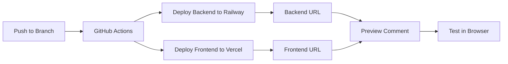

# Deployment Guide - Railway & Vercel

This guide explains how to set up automatic deployments for Forumyzer to Railway (backend) and Vercel (frontend) with preview environments for every branch.

## 🎯 Overview

- **Railway**: Hosts the Node.js backend API
- **Vercel**: Hosts the React webapp
- **GitHub Actions**: Automates deployments and creates preview URLs
- **Preview Branches**: Any branch starting with `claude/` gets automatic preview deployments

## 📋 Prerequisites

1. GitHub account with your forumyzer repository
2. Railway account (https://railway.app)
3. Vercel account (https://vercel.com)
4. API Keys ready:
   - YouTube Data API key
   - Google Gemini API key
   - OAuth Client ID & Secret

## 🚂 Railway Setup (Backend)

### Step 1: Create Railway Project

1. Go to https://railway.app/new
2. Click "Deploy from GitHub repo"
3. Select your `forumyzer` repository
4. Railway will auto-detect the Dockerfile

### Step 2: Configure Environment Variables

In Railway project settings, add these variables:

```bash
YOUTUBE_API_KEY=your_youtube_api_key
GEMINI_API_KEY=your_gemini_api_key
JWT_SECRET=your_random_secret_string
OAUTH_CLIENT_ID=your_google_oauth_client_id
OAUTH_CLIENT_SECRET=your_google_oauth_secret
NODE_ENV=production
PORT=3000
```

### Step 3: Set Root Directory

1. In Railway project settings
2. Set "Root Directory" to `backend`
3. Set "Start Command" to `node server.js`

### Step 4: Enable Public Networking

1. Go to Settings → Networking
2. Click "Generate Domain"
3. Copy the URL (e.g., `https://forumyzer-backend.railway.app`)

### Step 5: Get Railway Token

1. Go to https://railway.app/account/tokens
2. Create a new token
3. Save it for GitHub Secrets

## ▲ Vercel Setup (Frontend)

### Step 1: Import Project

1. Go to https://vercel.com/new
2. Import your `forumyzer` repository
3. Set Framework Preset to "Vite"

### Step 2: Configure Build Settings

```
Root Directory: webapp
Build Command: npm run build
Output Directory: dist
Install Command: npm install
```

### Step 3: Environment Variables

In Vercel project settings, add:

```bash
VITE_BACKEND_URL=https://your-railway-backend-url.railway.app
VITE_OAUTH_CLIENT_ID=your_google_oauth_client_id
```

### Step 4: Get Vercel Credentials

Run in terminal:
```bash
npm i -g vercel
vercel login
vercel link
cat .vercel/project.json
```

This gives you:
- `projectId` (VERCEL_PROJECT_ID)
- `orgId` (VERCEL_ORG_ID)

Get token from: https://vercel.com/account/tokens

## 🔐 GitHub Secrets Setup

Add these secrets to your GitHub repository:

1. Go to `Settings` → `Secrets and variables` → `Actions`
2. Click "New repository secret"
3. Add these secrets:

```
RAILWAY_TOKEN=your_railway_token
RAILWAY_PROJECT_ID=your_railway_project_id
VERCEL_TOKEN=your_vercel_token
VERCEL_ORG_ID=your_vercel_org_id
VERCEL_PROJECT_ID=your_vercel_project_id
```

## 🌿 Branch Deployment Strategy

### Main Branch (Production)
```bash
git push origin main
```
- Deploys to production Railway & Vercel
- URLs:
  - Frontend: `https://forumyzer.vercel.app`
  - Backend: `https://forumyzer-backend.railway.app`

### Claude Branches (Preview)
```bash
git push origin claude/feature-name
```
- Creates preview deployments
- URLs:
  - Frontend: `https://forumyzer-claude-feature-name.vercel.app`
  - Backend: `https://forumyzer-backend-claude-feature-name.railway.app`

### Pull Requests
- Automatic preview deployments
- Preview URLs posted as PR comment
- Updates on every commit

## 🎨 AI Studio Integration

To view previews in AI Studio panel:

1. **In AI Studio Settings:**
   - Enable "Live Preview"
   - Set preview URL template: `https://forumyzer-{branch}.vercel.app`

2. **In Your Code:**
   - AI Studio will auto-detect Vercel deployments
   - Preview panel updates on push

## 🔄 Automatic Deployment Flow



## 🧪 Testing Deployments

### After Backend Deployment (Railway)

```bash
# Test health endpoint
curl https://your-backend.railway.app/health

# Test API
curl -X POST https://your-backend.railway.app/api/forumize \
  -H "Content-Type: application/json" \
  -d '{"videoId":"dQw4w9WgXcQ"}'
```

### After Frontend Deployment (Vercel)

1. Visit your Vercel URL
2. Open browser DevTools → Console
3. Check for API connection errors
4. Test Forumyzer button on YouTube

## 📊 Monitoring

### Railway Dashboard
- View logs: `railway logs`
- Monitor metrics: CPU, Memory, Network
- Set up alerts for errors

### Vercel Dashboard
- Analytics: Page views, performance
- Function logs: API edge functions
- Web vitals: Core performance metrics

## 🐛 Troubleshooting

### Backend Not Starting
```bash
# Check Railway logs
railway logs --service backend

# Common issues:
# - Missing environment variables
# - Port binding error (ensure PORT=3000)
# - Dependencies not installed
```

### Frontend Build Failing
```bash
# Check Vercel logs in dashboard

# Common issues:
# - VITE_BACKEND_URL not set
# - Build command wrong
# - Missing dependencies
```

### CORS Errors
Update backend `server.js`:
```javascript
app.use(cors({
  origin: [
    'https://forumyzer.vercel.app',
    'https://forumyzer-*.vercel.app',
    'http://localhost:5173'
  ],
  credentials: true
}));
```

## 🔒 Security Best Practices

1. **Never commit `.env` files**
2. **Use GitHub Secrets** for sensitive data
3. **Rotate tokens** periodically
4. **Enable 2FA** on Railway and Vercel
5. **Review deployment logs** regularly

## 🚀 Quick Deploy Commands

### Deploy Main Branch
```bash
git checkout main
git pull
git push origin main
```

### Create Preview Branch
```bash
git checkout -b claude/youtube-live-boards
git add .
git commit -m "Add live board features"
git push -u origin claude/youtube-live-boards
```

### Manual Railway Deploy
```bash
railway login
railway link
railway up
```

### Manual Vercel Deploy
```bash
vercel --prod  # Production
vercel         # Preview
```

## 📱 Extension Distribution

The Chrome extension cannot be auto-deployed, but you can:

1. **Chrome Web Store:**
   - Manual upload at https://chrome.google.com/webstore/devconsole
   - Package: `cd extension && npm run build && zip -r extension.zip dist`

2. **Developer Mode:**
   - Share built extension folder
   - Users load unpacked in `chrome://extensions`

## 🎉 Success Checklist

- [ ] Railway project created and connected to GitHub
- [ ] Vercel project created and connected to GitHub
- [ ] All environment variables set in both platforms
- [ ] GitHub secrets configured
- [ ] GitHub Actions workflow file in place
- [ ] Main branch deploys successfully
- [ ] Claude branches create preview deployments
- [ ] Health endpoint returns 200 OK
- [ ] Frontend connects to backend API
- [ ] AI Studio preview panel works
- [ ] YouTube extension button appears and works

## 📚 Additional Resources

- [Railway Docs](https://docs.railway.app)
- [Vercel Docs](https://vercel.com/docs)
- [GitHub Actions](https://docs.github.com/en/actions)
- [Vite Deployment](https://vitejs.dev/guide/static-deploy.html)

## 🆘 Getting Help

If you encounter issues:

1. Check Railway/Vercel deployment logs
2. Review GitHub Actions workflow runs
3. Test API endpoints with curl
4. Check browser console for errors
5. Open an issue on GitHub with logs

---

**Happy Deploying! 🚀**
